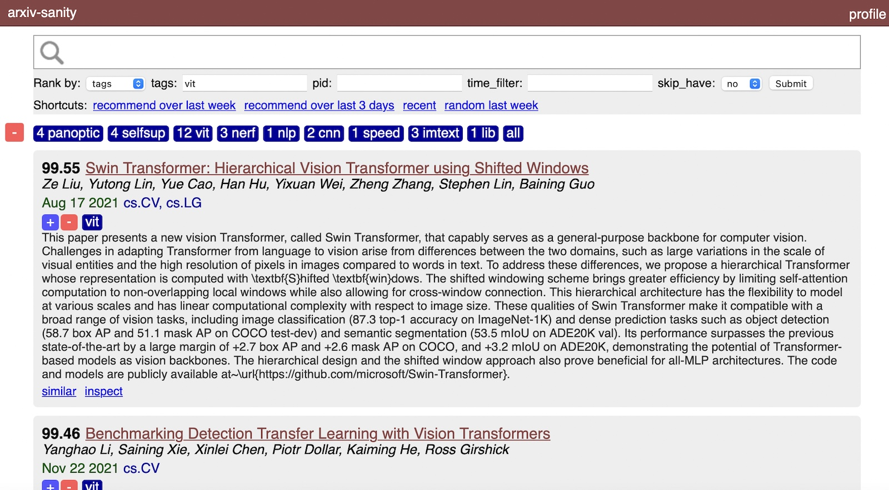

# arxiv-sanity-lite

A much lighter-weight arxiv-sanity from-scratch re-write. Periodically polls arxiv API for new papers. Then allows users to tag papers of interest, and recommends new papers for each tag based on SVMs over tfidf features of paper abstracts. Allows one to search, rank, sort, slice and dice these results in a pretty web UI. Lastly, arxiv-sanity-lite can send you daily emails with recommendations of new papers based on your tags. Curate your tags, track recent papers in your area, and don't miss out!

I am running a live version of this code on [arxiv-sanity-lite.com](https://arxiv-sanity-lite.com).



#### To run

To run this locally I usually run the following script to update the database with any new papers. I typically schedule this via a periodic cron job:

```bash
#!/bin/bash

python3 arxiv_daemon.py --num 2000

if [ $? -eq 0 ]; then
    echo "New papers detected! Running compute.py"
    python3 compute.py
else
    echo "No new papers were added, skipping feature computation"
fi
```

You can see that updating the database is a matter of first downloading the new papers via the arxiv api using `arxiv_daemon.py`, and then running `compute.py` to compute the tfidf features of the papers. Finally to serve the flask server locally we'd run something like:

```bash
export FLASK_APP=serve.py; flask run
```

All of the database will be stored inside the `data` directory. Finally, if you'd like to run your own instance on the interwebs I recommend simply running the above on a [Linode](https://www.linode.com), e.g. I am running this code currently on the smallest "Nanode 1 GB" instance indexing about 30K papers, which costs $5/month.

Finally, if you'd like to send periodic emails to users about new papers, see the `send_emails.py` script. I run this script in a daily cron job.

#### Requirements
Install requirements:
```bash
pip install -r requirements.txt
```

#### todos

- I need a proper requirements.txt and such
- The metas table should not be a sqlitedict but a proper sqlite table, for efficiency
- Build a reverse index to support faster search, right now we iterate through the entire database

#### License

MIT
